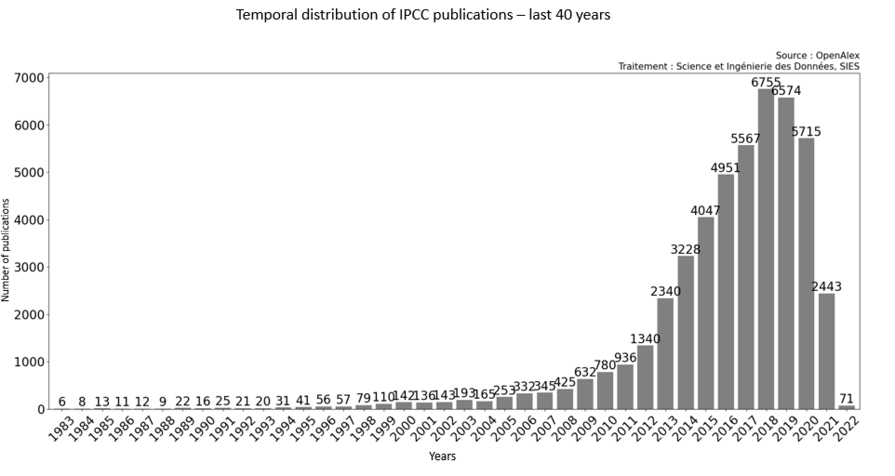
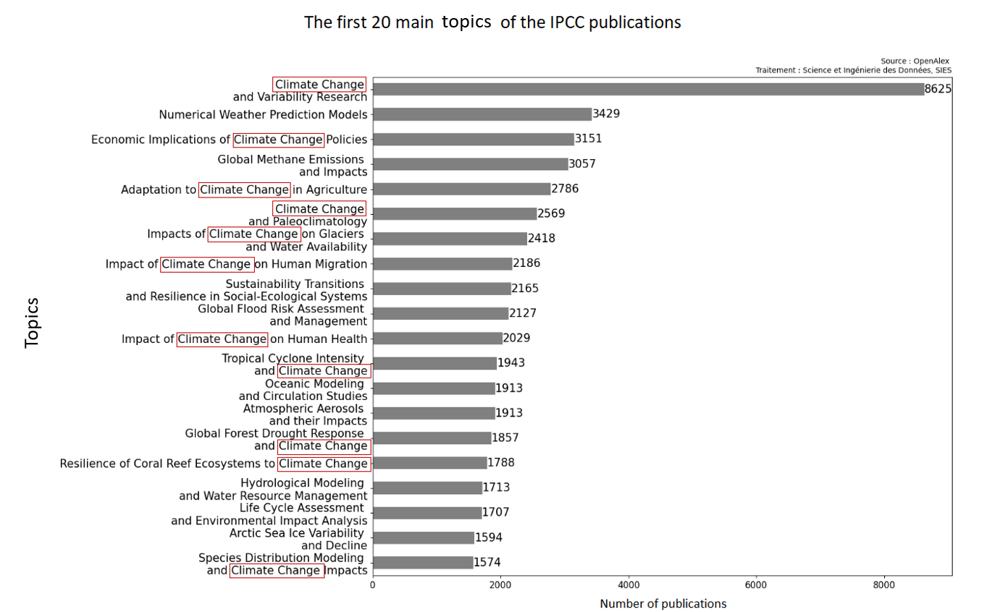
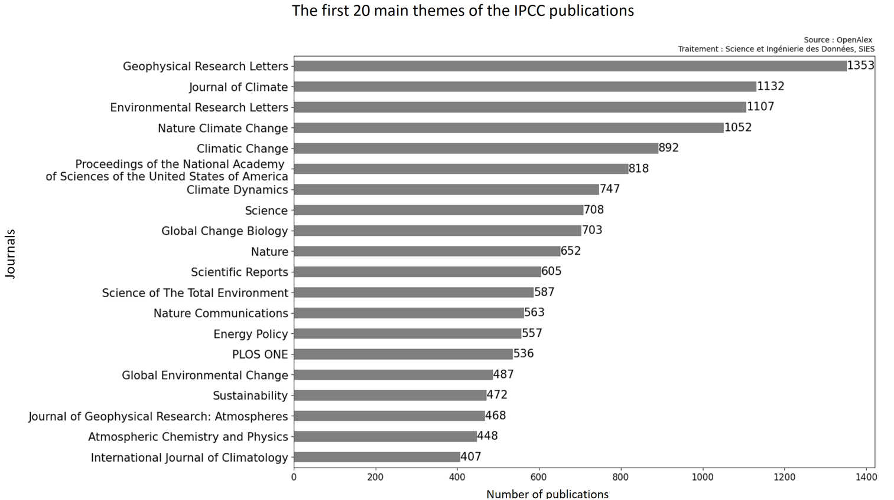
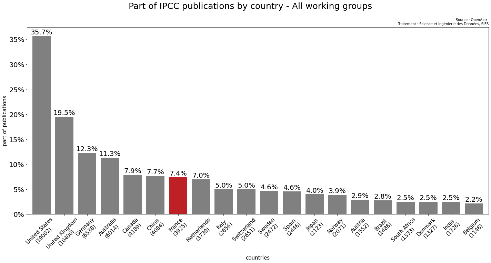
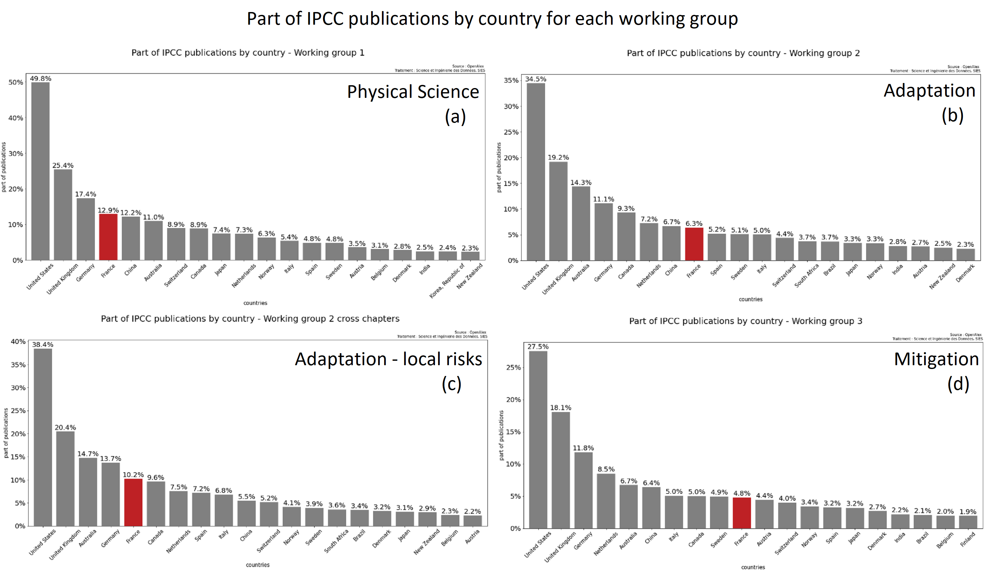
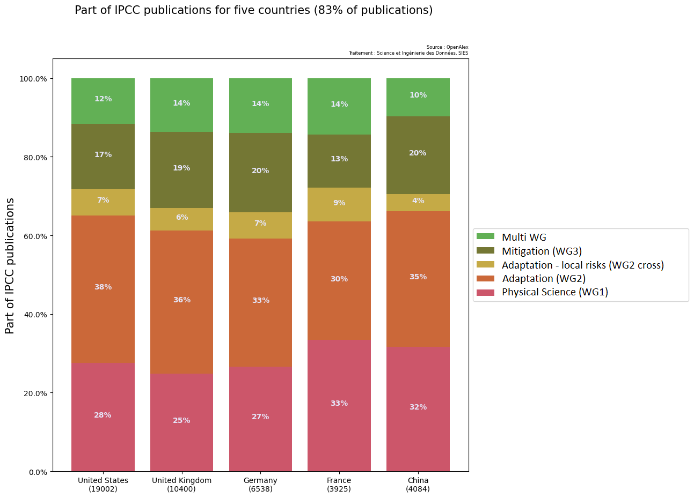

**Keywords**: french publications, machine learning, open data, open source, scanR, OpenAlex

# Abstract

# 1. Motivation

## 1.1 Presentation of IPCC and IPBES: Working Groups and dates

**The IPCC (Intergovernmental Panel on Climate Change)** assesses scientific information on climate change, providing reports to guide policymakers. It has three working groups sees as three main topics :

- Working Group I (WGI) focuses on the **physical science** of climate change.
- Working Group II (WGII) examines climate change impacts, **adaptation**, and vulnerabilities.
- Working Group III (WGIII) addresses climate change **mitigation** strategies.

The Sixth Assessment Report (AR6) was released in stages between 2021 and 2022.

**The IPBES (Intergovernmental Science-Policy Platform on Biodiversity and Ecosystem Services)**, established in 2012, assesses biodiversity and ecosystem services. It produces thematic and regional assessments, with the **Global Assessment Report (2019)** highlighting biodiversity loss and the need for urgent action.

Both platforms provide crucial scientific assessments that inform global climate and biodiversity policies.

## 1.2 Limits of the French Court of Audit study

In 2023, the French Court of Audit conducted a study on France's scientific output related to environmental transition. After hearings with the Directorate General for Research and Innovation (DGRI) and research operators, the Court analyzed the bibliography cited in the sixth IPCC report. The study found that French publications are the most cited in the physical sciences of climate change, highlighting the global impact of French research in this field.

However, this evaluation has important limitations. The IPCC bibliography is based on high-impact publications often from top journals, making it quite selective. This selection prioritizes more visible and well-known works, leaving out other important research that may not be as visible but still in the same topics as IPCC report. While this reflects France's scientific excellence, it does not fully represent the diversity of French scientific contributions to ecological transition.

## 1.3 How can we explore and recognize french publications related to the same topics as IPCC report from a global point of view ?

To fill this gap, we propose using a larger dataset, such as scanR. **ScanR has a significantly higher coverage** of publications with at least one French affiliation compared to other sources, contributing 92% to the overall aggregated corpus. This is much higher than databases like Scopus (67%), WoS (58%), or PubMed (29%), making ScanR a more comprehensive tool for capturing French scientific publications [@10.1162/qss_a_00179].
Unlike the IPCC's restricted approach, ScanR includes publications with at least one French affiliation, showing a larger view of research. This could allow us to capture a more diverse range of topics related to climate change physical science, adaptation and mitigation.

Initially, we will replicate the Court of Audit analysis of the IPCC bibliography to identify the main topics and their proportion of French contributions. Then, we will expand our study to know the top institutions, labs, regions, and researchers that provide solutions to the challenges of environemental transition in France, based on IPCC bibliography. In a second time, we will create a model that can recognize a publication about IPCC similar topics, and apply the model to scanR publications.
At the same time, we will conduct a similar analysis for the IPBES bibliography, following the same approach to identify the French contributions, and exploring less visible but valuable research related to biodiversity and ecosystem services.

# 2. IPCC and IPBES Bibliography Analysis and Model

We propose a method to analyze the bibliographies of IPCC and IPBES reports.

## 2.1 Data Collection and Cleaning

For each report, we collect the references:

- For IPCC report, we collect citations in .bib format for each chapter of each working group [@ipccbibliography].
- For IPBES report, we gather all citations via Zotero [@ipbesbibliography].

Once the data is collected, we clean the DOI (Digital Object Identifier) of each publication. The DOI should follow a specific format starting with '10.'. Any publication without a valid DOI is not considered.

## 2.2 Data Enrichment

After cleaning, the data contains features such as DOI, title, and main author. However, we still lack information such as institutions, researchers, countries, and topics associated with each publication.
To fill in the gap, we enrich the data by importing additional features from OpenAlex for each publication with a valid DOI. These features include: countries, year, topics, title, author names, institutions, RORs (Research Organization Registry) and journals.

OpenAlex is an international open-access database that provides metadata on research papers, authors, journals, and institutions. It aims to make academic information more accessible and supports data analysis and knowledge discovery in various fields. OpenAlex is a valuable tool for researchers and educators. We use the Api to import the features.

Next, we use the Biblioglutton Python library to fill in missing DOIs based on the title and main author. We also verify that the year retrieved from OpenAlex matches the year in the original dataset.

## 2.3 Data storage and visualization

Once the data is enriched with openAlex features, we edit the data and push them on a cluster elastic-search. As an exemple, for one publication (for a better visibility the data is troncated).
Some publications are used by both reports, with the following keys:

```json
{
  "doi": "10.1126/science.aaw6974",
  "year": "2018",
  "title": "Impacts of 1.5 °C global warming on natural and human systems",
  "rors": [
    ["https://ror.org/00rqy9422", "AU"],
    ["https://ror.org/03ztgj037", "DE"],
    ["https://ror.org/05sbt2524", "FR"],
    ["..."]
  ],
  "ipcc": [
    { "name": "wg1_chap_01", "wg": "1", "chap": 1 },
    { "name": "wg2_chap_01", "wg": "2", "chap": 1 },
    { "name": "wg2_chap_02", "wg": "2", "chap": 2 },
    { "name": "wg2_chap_04", "wg": "2", "chap": 4 },
    { "name": "wg2_chap_07", "wg": "2", "chap": 7 },
    { "name": "wg2_chap_08", "wg": "2", "chap": 8 },
    { "name": "wg2_chap_12", "wg": "2", "chap": 12 },
    { "name": "wg2_chap_13", "wg": "2", "chap": 13 },
    { "name": "wg2_chap_14", "wg": "2", "chap": 14 },
    { "name": "wg2_chap_15", "wg": "2", "chap": 15 },
    { "name": "wg2_chap_16", "wg": "2", "chap": 16 },
    { "name": "wg2_cross_chap_1", "wg": "2_cross", "chap": 1 },
    { "name": "wg2_cross_chap_4", "wg": "2_cross", "chap": 4 },
    { "name": "wg3_chap_01", "wg": "3", "chap": 1 },
    { "name": "wg3_chap_04", "wg": "3", "chap": 4 }
  ],
  "authors_name": [
    ["Ove Hoegh‐Guldberg", ["AU"]],
    ["Daniela Jacob", ["DE"]],
    ["Michael A. Taylor", ["JM"]],
    ["..."]
  ],
  "institutions_names": [
    ["University of Queensland", "AU"],
    ["German Climate Computing Centre", "DE"],
    ["University of the West Indies", "JM"],
    ["..."]
  ],
  "countries": ["CHN", "GBR", "FRA", "..."],
  "ipbes": [{ "chapter": "4" }],
  "topics": [
    "Impact of Climate Change on Human Migration",
    "Geoengineering and Climate Ethics",
    "Economic Implications of Climate Change Policies"
  ]
}
```

After that we used Highcharts, a graphic tool to visualize the graphs. At the same time, we plot the graphs also with python by making elastic-search requests.

## 2.4 Create a database

In the enriched database derived from the IPCC and IPBES publications, each publication is associated with the following attributes:

- A unique identifier (**DOI**)
- The publication **year**
- A **title** that best summarizes the publication
- The **main topics** covered by the publication
- The names of the **journals** in which the publication was published

Out of the 53,258 IPCC publications available on OpenAlex, only 48,219 have non-empty titles, topics, and journal names.

The goal is to identify these 48,219 publications that are not cited by the IPCC to form our training dataset.

After the analysis phase, we were wondering how to make a database with data from IPCC bibliography and data from other subjects than IPCC topics.

Initially, we explore the data from the reports and analize:

- Their temporal distribution
- The main topics
- The main journals were the publications are released





We conclued that the publications from the reports are recents, less than 10 years old for 90% of them. Some keywords seems to appear frequently, like "Climate Change" and IPCC publications are mainly released by scientific journals.

Using the OpenAlex API, we found 48,219 publications that meet the following criteria:

1. Publications that are **not cited by the IPCC**.
2. Publications that **do not contain specific terms** according to the top topics, such as "climate change" or "environmental impact" in their topics, ensuring that our model remains unbiased.
3. Publications that have a **global temporal distribution equivalent** to the IPCC's cited publications. For example, in 2018, there were 6,755 publications cited by the IPCC, so we retrieve 6,755 publications from OpenAlex that exclude certain topics. This process is repeated for each year in the temporal distribution of IPCC publications.

We conduct the exact same method for the IPBES report.

## 2.5 Train the model

Once the dataset is complete, we split it in two:

- 80% of data will be used to train the model
- 20% will be used as a test base

To train the model, we use fasttext. FastText is a library developed by Facebook AI Research for learning word representations and text classification. Unlike Word2Vec, FastText breaks words into subwords, improving its ability to handle rare or out-of-vocabulary words. It's fast, efficient, and supports multilingual models, making it ideal for various natural language processing tasks like sentiment analysis and text classification.

Fasttext enable to vectorize and apply a linear regression on the data. We try 2 kind of model:

- a model that determine if a publication is align with the same themes as the IPCC or IPBES report.

## 2.6 Comparative analysis of country contributions to IPCC Reports

In the first part of our analysis, we examined the publications from IPCC reports and compared the contributions of different countries. Now, we want to evaluate these contributions from a global perspective.

To simplify the process, we apply filters, as using the initial model (IPCC-like vs. non-IPCC) proves to be too resource-intensive. Instead, we focus on a easier approach.

We begin by analyzing French publications tagged as "IPCC" in ScanR, using the model to identify key themes and frequently appearing words in the titles and abstracts of publications related to the IPCC reports. Based on this analysis, we establish filters to apply to a sample that is 42 times larger than ScanR: OpenAlex.

# 3. Results

## 3.1 France in the publications cited by the IPCC Reports

### French publications cited by the IPCC

A total of 3,925 French publications are cited in the IPCC reports out of a total of 53,258 publications. This represents 7.4% of the total publications cited. France holds the 7th position in the ranking, just behind Canada and China, within the top 20 countries.



### France's position in specific research areas

France leads in publications related to physical sciences but is less frequently cited in areas concerning adaptation and mitigation.



French publications are more concentrated than those from other countries on theoretical sciences, as well as on documenting the impacts and risks related to ecosystems such as coral reefs, forests, and deserts.



These findings align with the results from the French Court of Audit, which also highlights a strong focus on physical sciences, with less emphasis on adaptation and mitigation strategies.

## Top institutions, laboratories and researchers in France

## 3.2 Models performances

## 3.3 The models on ScanR publications

## 3.4 On OpenAlex

# 4. Code availibility

The code developed is open source and available online on GitHub [https://github.com/dataesr/teds](https://github.com/dataesr/teds)

# References
