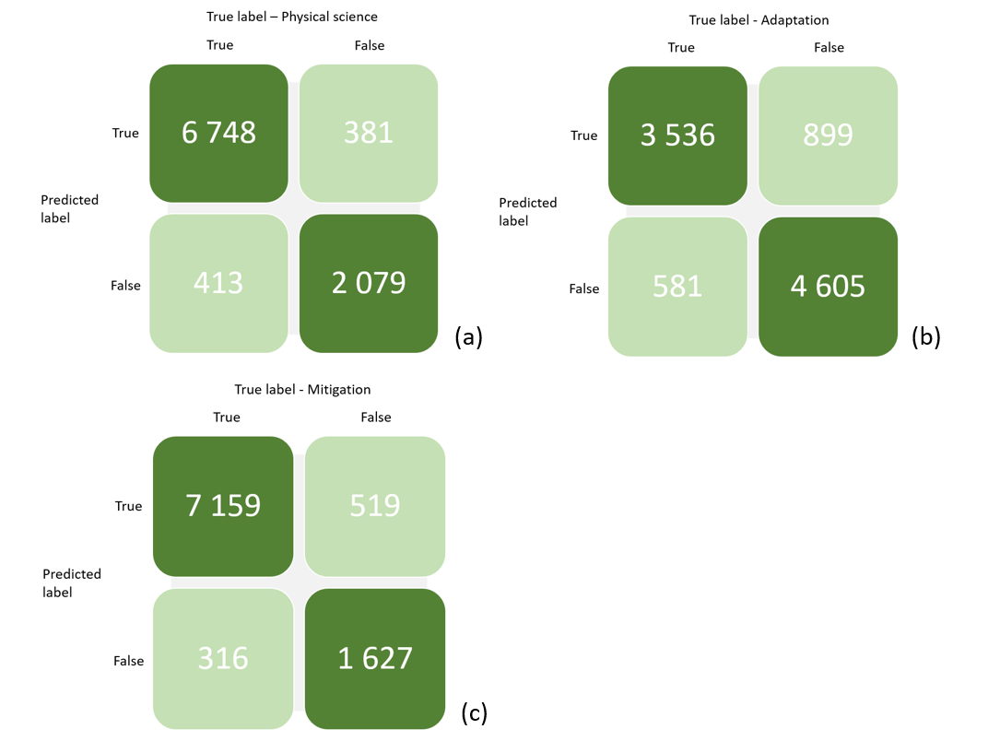
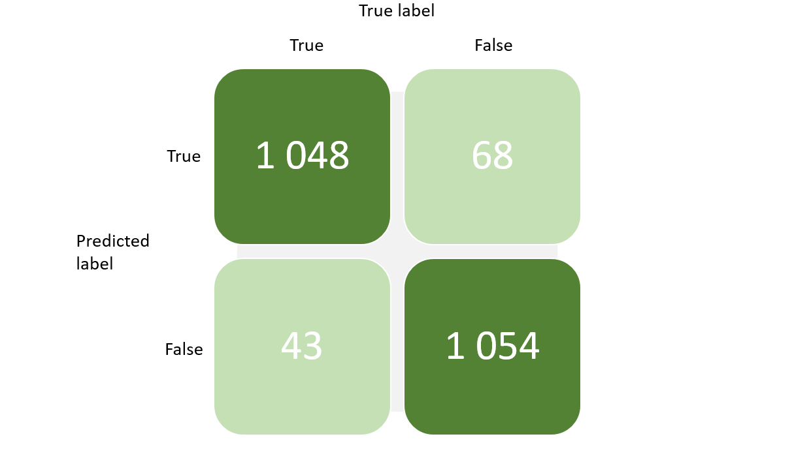
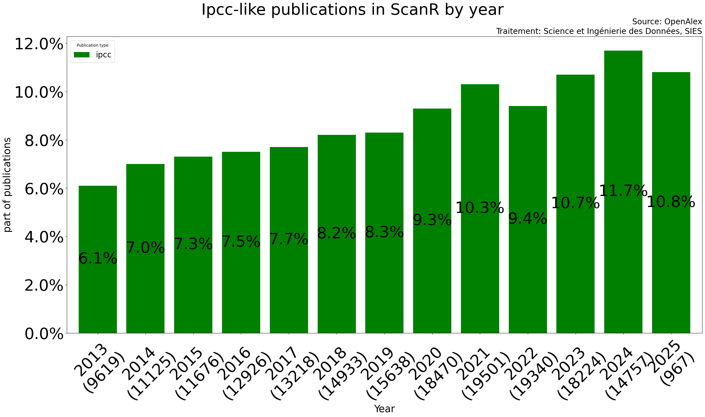
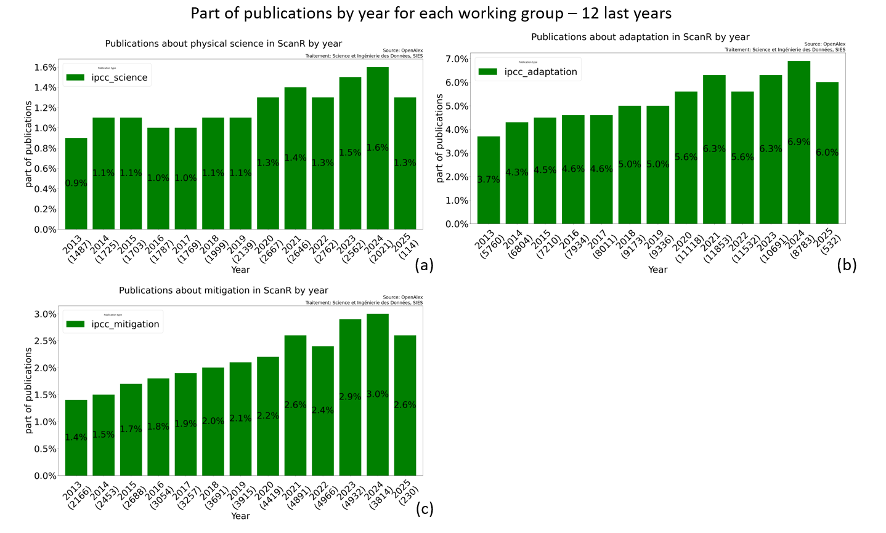

**Keywords**: French publications, IPCC, IPBES, Machine learning, NLP, open data, open source, scanR, OpenAlex

# Abstract

This paper is about the role of French scientific publications on environmental transition, sustainability, and climate, focusing on reports by the IPCC and IPBES. By analyzing the bibliographies of these reports, we explore the amount and diversity of French research on climate change and biodiversity. While France leads in physical sciences, the study reveals a lack of contributions on adaptation and mitigation strategies, which are important to address climate challenges. Using ScanR, we show that French research is actually more focused on adaptation than what the IPCC reports suggest. This analysis challenges the idea that French research mainly concentrates on physical sciences and highlights the importance of recognizing all French contributions to climate action. We use machine learning models and open data, such as OpenAlex, to enrich this analysis and better understand the distribution, themes, and institutions involved in this research. This study highlights the strengths and weaknesses of current bibliographic analysis systems and argues for more inclusive tools to assess the true scope of scientific contributions to environmental transition.

# 1. Motivation

## 1.1 Presentation of IPCC and IPBES: Working Groups and dates

**The IPCC (Intergovernmental Panel on Climate Change)** assesses scientific information on climate change, providing reports to guide policymakers. Between 2021 and 2022, they released the Sixth Assessment Report (AR6) in stages. It has three working groups that represent three main topics :

- Working Group 1 (WG1) focuses on the **physical science** of climate change.
- Working Group 2 (WG2) examines climate change impacts, **adaptation**, and vulnerabilities.
- Working Group 2 - cross chapters (WG2 cross) addresses the interactions between physical science and impacts, adaptation, and vulnerabilities.
- Working Group 3 (WG3) addresses climate change **mitigation** strategies.

**The IPBES (Intergovernmental Science-Policy Platform on Biodiversity and Ecosystem Services)**, established in 2012, assesses biodiversity and ecosystem services. It produces thematic and regional assessments, with the **Global Assessment Report (2019)** highlighting biodiversity loss and the need for urgent action.

Both agencies provide crucial scientific assessments that inform global climate and biodiversity policies.

## 1.2 Limits of the French Court of Audit study

In 2023, the French Court of Audit conducted a study on France's scientific output related to environmental transition. After hearings with the Directorate General for Research and Innovation (DGRI) and research operators, the Court analyzed the bibliography cited in the Sixth IPCC report. The study found that French publications are the most cited in the physical sciences of climate change, highlighting the global impact of French research in this field.

However, this evaluation has important limitations. The IPCC bibliography is based on high-impact publications often from top journals, making it quite selective. This selection prioritizes more visible and well-known works, leaving out other important research that may not be as visible but still in the same topics as IPCC report. While this reflects France's scientific excellence, it does not fully represent the diversity of French scientific contributions to ecological transition.

## 1.3 How can we explore and recognize french publications related to the same topics as IPCC and IPBES report from a larger point of view ?

To fill this gap, we propose using a larger dataset, such as scanR. **ScanR has a significantly higher coverage** of publications with at least one French affiliation compared to other sources, contributing 92% to the overall aggregated corpus. This is much higher than databases like Scopus (67%), WoS (58%), or PubMed (29%), making ScanR a more comprehensive tool for capturing French scientific publications [@10.1162/qss_a_00179].
Unlike IPCC approach, ScanR includes publications with at least one French affiliation, showing a larger view of research. This could allow us to capture a more diverse range of topics related to climate change physical science, adaptation and mitigation.

Initially, we will replicate the Court of Audit analysis of the IPCC bibliography to identify the main topics and the proportion of French contributions. Then, we will expand our study to highlight the top institutions, labs, regions, and researchers that provide solutions to the challenges of environmental transition in France, based on IPCC bibliography. In a second time, we will create a model that can recognize a publication about IPCC similar topics, and apply the model to scanR publications.
At the same time, we will conduct a similar analysis for the IPBES bibliography, following the same approach to identify the French contributions, and exploring less visible but valuable research related to biodiversity and ecosystem services.

# 2. IPCC and IPBES Bibliography Analysis and Model

We propose a method to analyze the bibliographies of IPCC and IPBES reports.

## 2.1 Data Collection and Cleaning

For each report, we collect the references:

- For IPCC report, we collect citations in .bib format for each chapter of each working group [@ipccbibliography].
- For IPBES report, we gather all citations via Zotero [@ipbesbibliography].

Once the data is collected, we clean the DOI (Digital Object Identifier) of each publication. The DOI should follow a specific format starting with '10.'. Any publication without a valid DOI is not considered.

## 2.2 Data Enrichment

After cleaning, the data contain features such as DOI, title, and main author. However, we still lack information such as institutions, researchers, countries, and topics associated with each publication.
To fill in the gap, we enrich the data by importing additional features from OpenAlex for each publication with a valid DOI. These features include: countries, year, topics, title, author names, institutions, RORs (Research Organization Registry) and journals.

OpenAlex is an international open-access database that provides metadata on research papers, authors, journals, and institutions. It aims to make academic information more accessible and supports data analysis and knowledge discovery in various fields. OpenAlex is a valuable tool for researchers and educators. We use there API to import the features[@OpenAlexAPI].

Next, we use the Biblioglutton Python library to fill in missing DOIs based on the title and main author. We also verify that the year retrieved from OpenAlex matches the year in the original dataset.

## 2.3 Data storage and visualization

Once the data is enriched with openAlex features, we edit the data and push it on a cluster elastic-search. As an exemple, for one publication (for a better visibility the data is truncated).
Some publications are used by both reports, with the following keys:

```json
{
  "doi": "10.1126/science.aaw6974",
  "year": "2018",
  "title": "Impacts of 1.5 °C global warming on natural and human systems",
  "rors": [
    ["https://ror.org/00rqy9422", "AU"],
    ["https://ror.org/03ztgj037", "DE"],
    ["https://ror.org/05sbt2524", "FR"],
    ["..."]
  ],
  "ipcc": [
    { "name": "wg1_chap_01", "wg": "1", "chap": 1 },
    { "name": "wg2_chap_01", "wg": "2", "chap": 1 },
    { "name": "wg2_chap_02", "wg": "2", "chap": 2 },
    { "name": "wg2_chap_04", "wg": "2", "chap": 4 },
    { "name": "wg2_chap_07", "wg": "2", "chap": 7 },
    { "name": "wg2_chap_08", "wg": "2", "chap": 8 },
    { "name": "wg2_chap_12", "wg": "2", "chap": 12 },
    { "name": "wg2_chap_13", "wg": "2", "chap": 13 },
    { "name": "wg2_chap_14", "wg": "2", "chap": 14 },
    { "name": "wg2_chap_15", "wg": "2", "chap": 15 },
    { "name": "wg2_chap_16", "wg": "2", "chap": 16 },
    { "name": "wg2_cross_chap_1", "wg": "2_cross", "chap": 1 },
    { "name": "wg2_cross_chap_4", "wg": "2_cross", "chap": 4 },
    { "name": "wg3_chap_01", "wg": "3", "chap": 1 },
    { "name": "wg3_chap_04", "wg": "3", "chap": 4 }
  ],
  "authors_name": [
    ["Ove Hoegh‐Guldberg", ["AU"]],
    ["Daniela Jacob", ["DE"]],
    ["Michael A. Taylor", ["JM"]],
    ["..."]
  ],
  "institutions_names": [
    ["University of Queensland", "AU"],
    ["German Climate Computing Centre", "DE"],
    ["University of the West Indies", "JM"],
    ["..."]
  ],
  "countries": ["CHN", "GBR", "FRA", "..."],
  "ipbes": [{ "chapter": "4" }],
  "topics": [
    "Impact of Climate Change on Human Migration",
    "Geoengineering and Climate Ethics",
    "Economic Implications of Climate Change Policies"
  ]
}
```

After that, we used Highcharts, a graphic tool to visualize the graphs. At the same time, we plot the graphs also with python by making elastic-search requests.

## 2.4 Create a database

In the enriched database from the IPCC and IPBES publications, each publication is associated with the following attributes:

- A unique identifier (**DOI**)
- The publication **year**
- A **title** that best summarizes the publication
- The main **topics** covered by the publication: publications in OpenAlex are tagged with Topics using an automated system that takes into account the available information about the work, including title, abstract, source (journal) name, and citations
- The names of the **journals** in which the publication was published

Out of the 53,258 IPCC publications available on OpenAlex, only 48,219 have non-empty titles, topics, and journal names.

The goal is to identify 48,219 other publications that are not cited by the IPCC to form our training dataset.
After the analysis phase, we were wondering how to make a database with data from IPCC bibliography and data from other subjects than IPCC topics.

Initially, we explore the data from the reports and analize:

- Their temporal distribution
- The main topics
- The main journals were the publications are released


_Temporal distribution of French IPCC publications._


_Topics distribution of French IPCC publications._


_Journals distribution of French IPCC publications._

We conclude that the publications from the reports are recent, less than 10 years old for 90% of them. Some keywords seem to appear frequently, like "Climate Change" and IPCC publications are mainly released by scientific journals.

Using the OpenAlex API, we found 48,219 publications that meet the following criterias:

1. The publication is **not cited by the IPCC**.
2. The publication **does not contain specific terms** according to the top topics, such as "climate change" or "environmental impact" in their topics, ensuring that our model remains unbiased.
3. The publication has a **global temporal distribution equivalent** to the IPCC's cited publications. For example, in 2018, there were 6,755 publications cited by the IPCC, so we retrieve 6,755 publications from OpenAlex that exclude certain topics. This process is repeated for each year in the temporal distribution of IPCC publications.

We conduct the exact same method for the IPBES report.

## 2.5 Train the model

Once the dataset is complete, we split it in two:

- 80% of data will be used to train the model
- 20% will be used as a test base

To train the model, we use FastText. FastText is a library developed by Facebook AI Research to learn word representations and text classification. Unlike Word2Vec, FastText breaks words into subwords, improving its ability to handle rare or out-of-vocabulary words. It's fast, efficient, and supports multilingual models, making it ideal for various natural language processing tasks like sentiment analysis and text classification.

Fasttext enables vectorization and fits a linear regression on the data. We try 2 kind of model:

- a model that determine if a publication is aligned with the same topics as the IPCC or IPBES report.
- a model to be applied only to "IPCC-like" publications, to determine the most relevant working group and identify whether the publication focuses on physical science, adaptation, or mitigation.

## 2.6 Comparative analysis of country contributions to IPCC Reports

In the first part of our analysis, we examined the publications from IPCC reports and compared the contributions of different countries. Now, we want to evaluate these contributions from a global perspective.

To simplify the process, we apply filters, as using the initial model (IPCC-like vs. non-IPCC) proves to be too resource-intensive. Instead, we focus on a easier approach.

We begin by analyzing French publications tagged as "IPCC-like" in ScanR by using the model. We identify the topics and frequently appearing words in the titles and abstracts of publications related to the IPCC reports. Based on this analysis, we establish filters to apply to a sample that is 42 times larger than ScanR: OpenAlex.

# 3. Results

## 3.1 France in the publications cited by the IPCC Reports

### French publications cited by the IPCC and IPBES

A total of 3,925 French publications are cited in the IPCC reports out of a total of 53,258 publications. This represents 7.4% of the total cited publications. France holds the 7th position in the ranking, just behind Canada and China.


_Part of IPCC publications by country for all working groups._

In the IPBES reports, 458 French publications are cited out of a total of 6106. This represents 7.5% of the total cited publications. France holds the 7th position as well in the ranking, just behind Germany and Netherlands.


_Part of IPBES publications by country._

### France's position in specific research areas

France leads in publications related to physical sciences but is less frequently cited in areas concerning adaptation and mitigation.


_Part of IPCC publications for each working groups._

French publications are more focused on theoretical sciences (a) than those from other countries: nearly 13% of the publications in WG1 have a French contribution. We can see the same trend for the publications that relate the impacts and risks related to ecosystems such as coral reefs, forests, and deserts (cross chapters from the second working group, the (c) image in _Part of IPCC publications for each working groups_).


_Part of IPCC publications for five countries._

These findings also match those from the French Court of Audit, which shows a strong focus on physical sciences, with less attention to adaptation and mitigation strategies, compared to other leading countries. Also, France, Germany, and the UK have 14% of their publications cited in several working groups, which is lower than the US or China.

### Top Institutions, Laboratories, and Researchers in France

In France, the **CNRS (National Centre for Scientific Research)** is a leader in IPCC and IPBES publications, with IRD (Research Institute for Development) also making significant contributions.


_French institutions contributing to IPCC publications._


_French institutions contributing to IPBES publications._

We can see that several national organizations appear in both reports, however there is a clear territorial difference at the institutional level. The institutions most active in the IPCC publications are mainly located in Île-de-France, Toulouse, and Grenoble, while those in the IPBES publications are mostly in Île-de-France, Grenoble, Chambéry, and Montpellier.

The **Climate Science Laboratory** is another key player in climate research, leading the way in IPCC and IPBES publications.


_French laboratories contributing to IPCC publications._


_French laboratories contributing to IPBES publications._

The laboratories most active in the publications cited by the IPCC are located mainly in Île-de-France, Toulouse, Grenoble, Bretagne and Bordeaux. Those of the IPBES are located in Île-de-France, Montpellier, Grenoble, Toulouse, Chizé, Dijon and Marseille.


_French authors contributing to IPCC publications._


_French authors contributing to IPBES publications._

French researchers are also highly involved, with some contributing to both IPCC and IPBES reports. For example, Philippe Ciais is particularly active and cited in both reports.

## 3.2 Models performances

Out of the 19,288 publications in the **IPCC** test set, 18,788 publications are correctly predicted, representing **97%** of the total publications.


_Confusion matrix showing the performance of the first IPCC model._

When a publication is identified as "IPCC-like", a second model is applied to classify it into the appropriate working group. The second model predicts which working group the publication is most likely associated with.


_Confusion matrix illustrating the performance of the second IPCC model, which categorizes publications by working group._

For each working group, there are 9,644 publications in the test set. The model performance for each group is as follows:

- For **Physical Science**, 8,875 publications are correctly predicted, representing **92%** of the publications in this category.
- For **Adaptation**, 8,137 publications are correctly predicted, representing **84%** of the publications in this category.
- For **Mitigation**, 8,768 publications are correctly predicted, representing **91%** of the publications in this category.

However, for the **Adaptation** and **Mitigation** categories, the model shows a significant number of false positives. This suggests that the model tends to overestimate the number of publications categorized in these groups. This overestimation indicates that the model might label more publications as "Adaptation" or "Mitigation" than it should, leading to a higher rate of false positives in these categories.

In the **IPBES** test set, there are 2213 publications and 2101 publications are correctly predicted, representing **95%** of the total publications.


_Confusion matrix showing the performance of the IPBES model._

## 3.3 The models on ScanR publications

### Figures

We filter the references that have a DOI in scanR, as our analysis depends only on these types of references, excluding other types that follow different structures. This ensure consistency in our approach.
The proportion of publications addressing topics similar to those of the IPCC seems to be increasing in recent years. The graph "IPCC model on scanR publications by year" illustrates this trend, showing a growing number of "IPCC-like" publications in scanR over time.


_IPCC model on scanR publications by year._

The second model seems to detect more publications related to adaptation.


_Working group model on scanR publications by year._

The IPBES model ...


_IPBES model on scanR publications by year (à faire)._

### Community network

On scanR, we can visualize community networks, based on themes or on authors.

A community network is a way to group things together based on how closely they are connected. In this case, a "node" is either an author or a theme, and a "link" is a co-publication between them. It allows to find clusters of authors or themes that are more connected to each other through co-publications. These groups, called communities, help us understand how the system is organized and how different parts work together. Looking at these groups can help us find patterns and learn more about the connections between authors or themes[@hal-04892262].

The topics cited by the IPCC cover a broad range of topics, and the IPCC's publication network is denser than that predicted by the model. This indicates that the topics are often cited together across multiple publications.
The graph _Comparison between two topics networks._ shows two topic networks: one showing the denser network from IPCC reports (a) and the predicted network from our first model (b). From this, we can conclude that the topics in the IPCC reports are more tightly interconnected.


_Comparison between two topics networks._

It’s interesting to see that 'soil moisture' is linked to 'evapotranspiration' in both graphs, but the predicted graph (d) introduces more technical terms. In this graph, 'soil moisture' is connected to 'SMOS' and 'L-band.' SMOS is a satellite from the European Space Agency (ESA) that measures soil moisture using radiation in the L-band (1.4 GHz). This shows that the predicted graph can focuses on more technical details.


_Comparison on one topic._

We can see a similar dynamic for authors, a denser network for authors from IPCC reports (e). For instance, a main block composed of Philippe Ciais and Laurent Bopp that represent an "IPCC cluster"


_Comparison between two authors networks._

## 3.4 The second model on OpenAlex

On OpenAlex, we apply the filters identified through the scanR analysis. After that, we plot the _Part of publications in OpenAlex for 7 countries_. In this graph, China and India appear to be increasingly publishing on IPCC-related topics, and France seems to remain stable.


_Part of publications in OpenAlex for 7 countries._

When comparing the rankings, India's progress stands out as the most impressive on an inter-country scale. However, France is dropping from 7th to 9th place.


_Rank for 7 countries in OpenAlex publications._

Given the large volume of publications in OpenAlex related to IPCC subjects, we analyze the _Distribution of OpenAlex publication types for five countries_ only for the year 2022 due to the data volume. In this graph, France appears to focus more on adaptation than the other four countries.


_Distribution of OpenAlex publication types for five countries._

# 4. Code availibility

The code developed is open source and available online on GitHub [https://github.com/dataesr/teds](https://github.com/dataesr/teds)

# References

```

```
